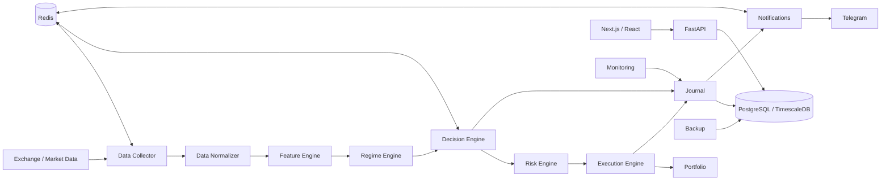

# Vikeur Trading Quant

A modular full-stack platform for market-data collection, strategy evaluation, risk controls, paper/live execution, monitoring, and operational notifications.

> Portfolio / technical case study. The repository is intended to demonstrate architecture, engineering practices, and implementation decisions. It is not presented as a guarantee of trading performance.

## What this project demonstrates

- Python / FastAPI backend
- Modular engine architecture with explicit dependency boundaries
- Next.js / React / TypeScript dashboard
- PostgreSQL / TimescaleDB for persistent and time-series data
- Redis for event distribution and fast coordination
- REST APIs and exchange integrations
- Telegram notifications
- Docker / Docker Compose deployment
- GitHub Actions CI and container image publishing
- Automated tests, linting, formatting and architecture checks
- Paper trading, backtesting and governed live-execution paths
- Risk management, kill switch and operational monitoring

## Architecture at a glance

For the detailed architecture and data flows, see [`docs/ARCHITECTURE.md`](docs/ARCHITECTURE.md).

## Main components

| Component | Responsibility |
|---|---|
| `data_collector` | Market-data collection and exchange adapters |
| `data_normalizer` | Canonicalisation and freshness checks |
| `feature_engine` | Feature calculation |
| `regime_engine` | Market-regime classification |
| `decision_engine` | Strategy signal fusion and decision logic |
| `risk_engine` | Risk checks, exposure and sizing controls |
| `execution_engine` | Paper / live order execution |
| `portfolio` | Exchange balance snapshots |
| `backtesting` | Historical strategy evaluation |
| `paper_trading` | Simulated execution |
| `strategy_lifecycle` | Strategy status and lifecycle rules |
| `calibration` | Probability / confidence calibration |
| `journal` | Persistent event journal |
| `notifications` | Telegram notification delivery |
| `monitoring` | Health and operational monitoring |
| `backup` | Database backup workflow |
| `api` | FastAPI application consumed by the dashboard |
| `frontend` | Next.js / React dashboard |

## Engineering practices

The project includes automated backend and frontend tests, static checks, formatting checks and import-boundary checks. The CI workflow runs pytest with a coverage threshold, Ruff, Black, mypy, import-linter, ESLint, TypeScript checks and frontend tests.

The deployment workflow builds container images and publishes them to GHCR. VPS deployment remains a deliberate operational step rather than an automatic production deployment.

## Execution safety

The system separates paper and live capital paths and includes backend-side governance for enabling live execution. Risk controls and the kill switch are enforced on the backend rather than relying only on the frontend.

The project also documents known limitations explicitly. Experimental components are not presented as production-ready capabilities.

## Security

Secrets are supplied through environment variables and are intentionally excluded from the public source snapshot. See [`docs/SECURITY.md`](docs/SECURITY.md).

Before any public deployment, review the Git history and repository settings independently of this source snapshot.

## Local development

See [`docs/LOCAL_DEVELOPMENT.md`](docs/LOCAL_DEVELOPMENT.md) for the development workflow and test commands.

## Technical decisions

See [`docs/TECHNICAL_DECISIONS.md`](docs/TECHNICAL_DECISIONS.md) for the reasoning behind the modular engine, Redis, PostgreSQL/TimescaleDB, Docker Compose, API separation and controlled deployment approach.
