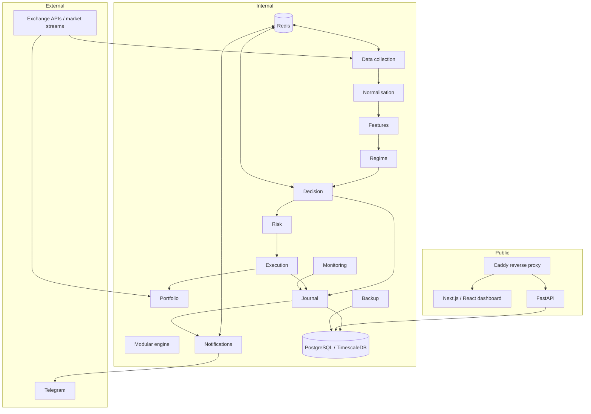

# Architecture

## 1. High-level model

Vikeur is organised as a modular system rather than a collection of unrelated scripts. The core engine keeps closely coupled processing stages in one process while operationally independent capabilities are separated into services.

## 2. Core processing pipeline

1. Market data is collected through exchange adapters.
2. Raw data is normalised into the internal representation.
3. Features are calculated.
4. The current market regime is evaluated.
5. Decision engines produce and combine signals.
6. Risk checks validate the resulting decision.
7. The execution layer performs paper or live execution according to the governed execution mode.
8. Relevant events are persisted to the journal and delivered to operational notifications.

## 3. Modular boundaries

The repository uses explicit import-linter contracts to protect module boundaries. The goal is to keep business logic testable and prevent accidental coupling between unrelated layers.

The engine is deliberately a modular monolith: tightly coupled high-frequency processing stages remain in one process, while the API, notifications, monitoring, portfolio and backup responsibilities are isolated as services.

## 4. Data and coordination

### PostgreSQL / TimescaleDB

Used for durable application data and time-series workloads such as market and event history.

### Redis

Used for fast coordination and event distribution. Redis is not treated as the source of truth for durable business records.

### Journal

The journal consumes system events and persists them to the database. This provides a durable history that can be inspected independently from transient event delivery.

## 5. API and frontend

The FastAPI service provides the backend API used by the Next.js / React dashboard. Authentication and governance checks are performed server-side for sensitive operations.

The frontend is intentionally not treated as a security boundary: critical controls remain in the backend.

## 6. Deployment topology

Docker Compose defines the runtime topology. The reverse proxy is the public entry point. Database and Redis services are placed on an internal Docker network and are not directly published to the Internet.

## 7. Failure handling

The architecture includes health checks, heartbeats, logging, retries where appropriate, monitoring, a kill switch, and explicit operational notifications.

External integrations are treated as failure-prone dependencies. Business-critical operations should therefore be validated after API calls and protected against duplicate processing where an operation may be retried.
